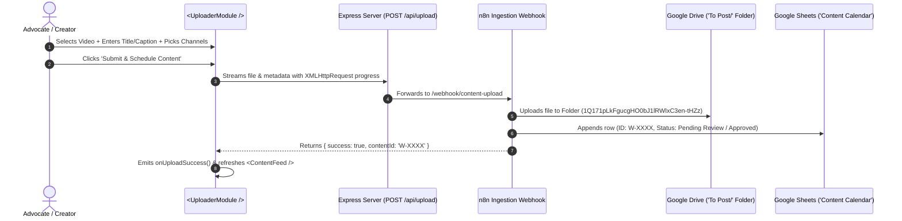

# 📤 VBL Law Chambers — Content Uploader Module (`web/src/components`)

This directory contains the self-contained, modular **Content Uploader & Social Media Publishing Component Suite** for VBL Law Chambers.

---

## 📂 File Architecture

| File | Description |
|---|---|
| **`UploaderModule.jsx`** | Main entry component exporting the unified `<UploaderModule />` |
| **`ContentComposer.jsx`** | Drag & drop media upload zone, live video/image player preview, Will Drafting legal templates, hashtag inserter, 6-platform selector, and progress bar |
| **`ContentFeed.jsx`** | Live Google Sheets synchronization feed with instant search and status filtering (*Pending Review, Approved, Posted, Retry / Failed*) |
| **`PostCard.jsx`** | Individual content item card with Content ID, scheduled time (IST), per-platform delivery status chips, and direct Google Drive file link |
| **`StatsGrid.jsx`** | Summary metric cards: *Total Content, Pending Approval, Approved / Scheduled, Published Live* |

---

## 🔌 How It Connects to Backend & Automation



---

## 💻 Usage Example

```jsx
import UploaderModule from './components/UploaderModule';

function Dashboard() {
  const [posts, setPosts] = useState([]);

  return (
    <UploaderModule
      posts={posts}
      onUploadSuccess={() => fetchPosts()}
      onToast={(msg, type) => showNotification(msg, type)}
    />
  );
}
```
